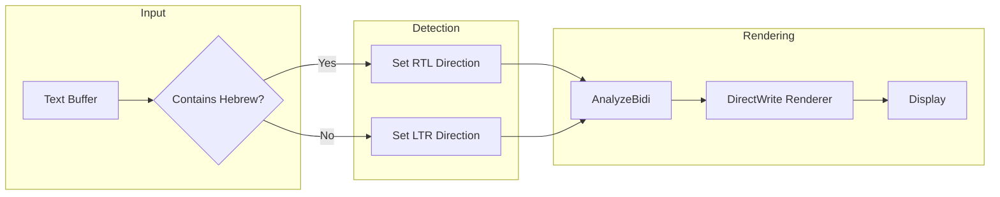

[](https://dev.azure.com/shine-oss/terminal/_build/latest?definitionId=1&branchName=main)

# Windows Terminal with Hebrew RTL Support

A fork of Windows Terminal with native **Right-to-Left (RTL) support for Hebrew**.

## ✨ What's New: Hebrew RTL Support

This fork adds automatic Hebrew text rendering with proper right-to-left display.



**Features:**
- ✅ Automatic detection of Hebrew characters (U+0590-U+05FF)
- ✅ Proper RTL rendering using DirectWrite BiDi analysis
- ✅ Mixed Hebrew/English text support
- ✅ No configuration needed - just works!

---

## 🚀 Quick Start

### Install on Windows

**Option 1: WinGet (Recommended)**
```powershell
winget install --id Microsoft.WindowsTerminal -e
```

**Option 2: Microsoft Store**

[Download from Microsoft Store](https://aka.ms/terminal)

**Option 3: GitHub Releases**

Download `.msixbundle` from [Releases](https://github.com/microsoft/terminal/releases) and double-click to install.

### Build from Source

```powershell
# 1. Clone the repo
git clone https://github.com/hoodini/terminal.git
cd terminal

# 2. Configure environment (installs VS 2022 + dependencies)
winget configure .config\configuration.winget

# 3. Build
Import-Module .\tools\OpenConsole.psm1
Set-MsBuildDevEnvironment
Invoke-OpenConsoleBuild
```

> **Requirements:** Windows 10 2004+, [Developer Mode enabled](https://docs.microsoft.com/en-us/windows/uwp/get-started/enable-your-device-for-development)

---

## 🧪 Testing RTL Support

### Quick Test
Open Terminal and type or paste Hebrew text:

```
שלום עולם
Hello עולם
מספר 123 בעברית
```

### Expected Behavior
| Input | Expected Display |
|-------|-----------------|
| `שלום עולם` | Text flows right-to-left |
| `Hello עולם` | "Hello" on left, "עולם" on right |
| `echo שלום` | Command LTR, Hebrew argument RTL |

### Test File
Open the included test file:
```powershell
cat .\doc\hebrew-test-examples.txt
```

---

## 📁 Project Structure

```
terminal/
├── src/
│   ├── renderer/atlas/       # RTL changes here
│   │   ├── AtlasEngine.cpp   # Added AnalyzeBidi call
│   │   ├── DWriteTextAnalysis.cpp  # Hebrew detection
│   │   └── common.h          # BiDi level storage
│   ├── cascadia/             # Terminal UI
│   └── host/                 # Console host
├── doc/
│   ├── hebrew-rtl-support.md        # RTL documentation
│   ├── IMPLEMENTATION_SUMMARY.md    # Technical details
│   └── hebrew-test-examples.txt     # Test cases
└── tools/                    # Build scripts
```

---

## 📚 Documentation

| Document | Description |
|----------|-------------|
| [Hebrew RTL Support](./doc/hebrew-rtl-support.md) | Feature overview |
| [Implementation Summary](./doc/IMPLEMENTATION_SUMMARY.md) | Technical details |
| [Building Guide](./doc/building.md) | Detailed build instructions |
| [Contributing](./CONTRIBUTING.md) | How to contribute |

---

## 🤝 Contributing

1. Read [CONTRIBUTING.md](./CONTRIBUTING.md)
2. Fork & create a branch
3. Make changes & test
4. Submit a PR

---

## 📜 License

[MIT License](./LICENSE)

---

## 🔗 Links

- [Official Docs](https://aka.ms/terminal-docs)
- [Original Repo](https://github.com/microsoft/terminal)
- [Report Issues](https://github.com/hoodini/terminal/issues)
